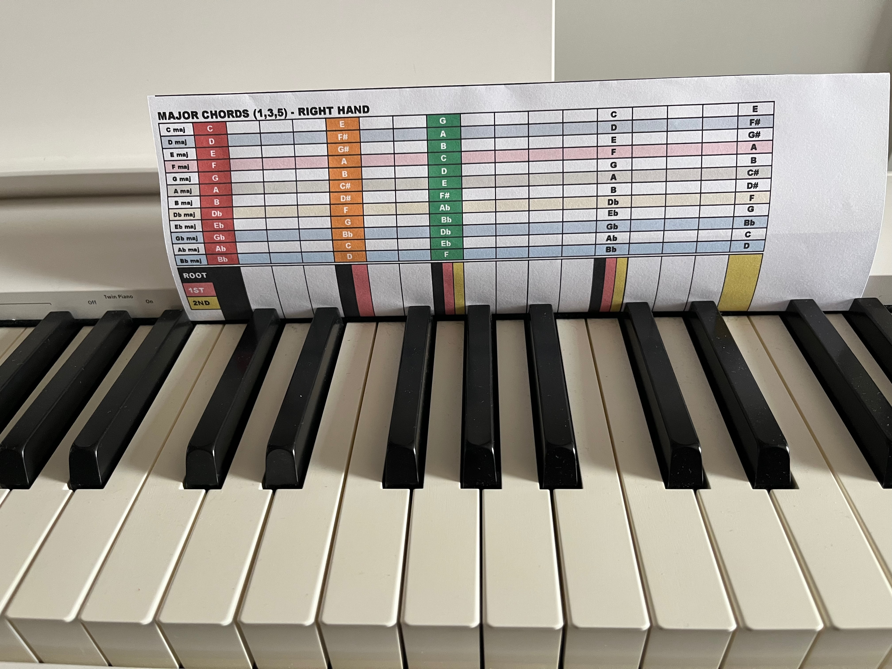
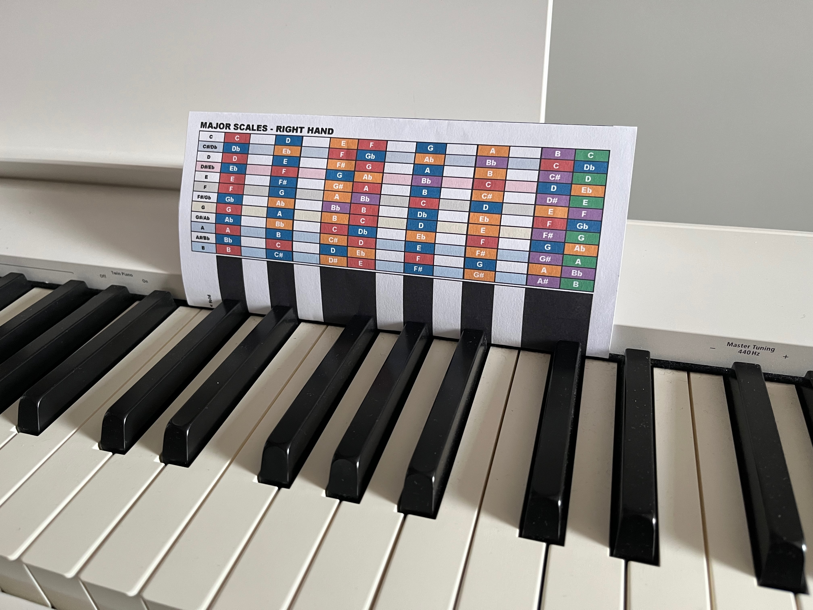
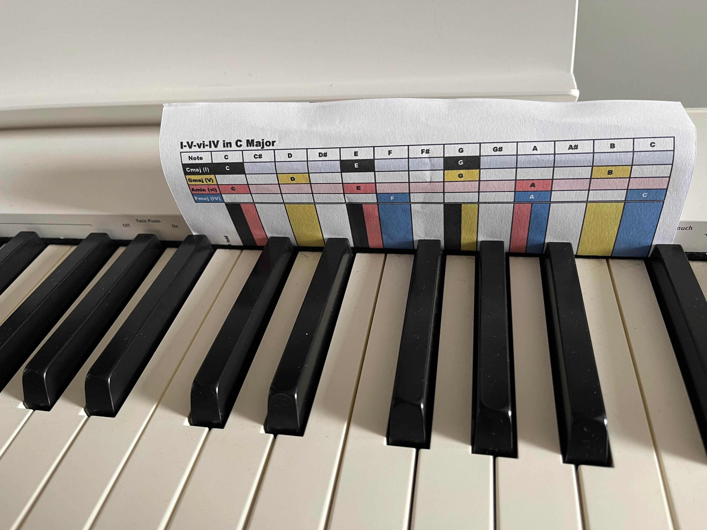

# Piano Learning Helpers

This repository contains graphical helpers designed to assist with learning piano chords, scales, and chord progressions. These documents can be printed and placed behind the piano keys to visually guide you on where to place your fingers. They work fine with my Roland FP30X and should also fit other keyboards and classical pianos. 

## Features

- **Chords:** Visual guides for major, minor, and various other chord types.
- **Scales:** Finger placement for major, minor, and other scales.
- **Progressions:** Visual aids for common chord progressions.

## Screenshots

### Chords


### Scales


### Chord Progressions


## Getting Started

### Prerequisites

To use these graphical helpers, you will need:
- A printer (documents fit A4 format)
- Scissors (to cut out the guides, not mandatory)
- Tape (to attach the guides behind your piano keys, not mandatory)

### Installation

1. Clone the repository:
   ```sh
   git clone https://github.com/blebleblee/piano-helpers.git
   ```

2. Navigate to the repository folder:
   ```sh
   cd piano-helpers
   ```

3. Print the documents from the following folders:
   - [Chords](chords)
   - [Scales](scales)
   - [Progressions](progressions)

4. Fold or cut out the guides and place them behind your piano keys according to the provided instructions.

## Usage

- Place the printed guides behind your piano keys as shown in the example pictures.
- Follow the visual cues to learn where to place your fingers for different chords, scales, and progressions.

## Contributing

Contributions are welcome! Please fork this repository and submit a pull request for any enhancements or bug fixes.

## License

This project is licensed under the MIT License - see the [LICENSE](LICENSE) file for details.

## Support and Donations

If you find this project helpful and would like to support its development, consider buying me a coffee!

<script type="text/javascript" src="https://cdnjs.buymeacoffee.com/1.0.0/button.prod.min.js" data-name="bmc-button" data-slug="blebleblee" data-color="#FFDD00" data-emoji="" data-font="Cookie" data-text="Buy me a coffee" data-outline-color="#000000" data-font-color="#000000" data-coffee-color="#ffffff" ></script>
